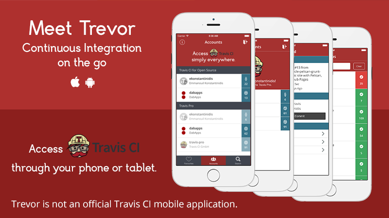

Trevor 
=====================
A hybrid app based on Ionic Framework, AngularJS and Apache Cordova.

## Install Packages
The `setup` script will handle the installation of ionic and all the other dependencies.

    npm run setup

## Running the app on the browser

    ionic serve
    npm run watch

## Releasing the app

    ionic platform add ios
    ionic platform add android
    npm run release
    ionic build ios
    ionic build android

Then prepare to release for each store.

## Running the tests
There are jshint tests(through *gulp*) and karma-jasmine tests(through *NPM*). To run both:

    npm test
